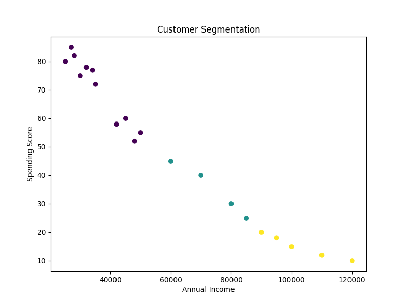

# Customer Segmentation Analysis

## Project Overview

This project uses K-Means Clustering to segment customers based on their annual income and spending score.

## Features

* Customer Data Analysis
* K-Means Clustering
* Customer Group Identification
* Data Visualization using Matplotlib

## Tools Used

* Python
* Pandas
* Scikit-Learn
* Matplotlib
* Google Colab

## Files Included

* Customer_Segmentation.ipynb
* customer_data.csv
* customer_segmentation.png

## Outcome

Successfully grouped customers into distinct segments to support targeted marketing and business decision-making.

## Output

Customer segmentation visualization generated using K-Means clustering.

